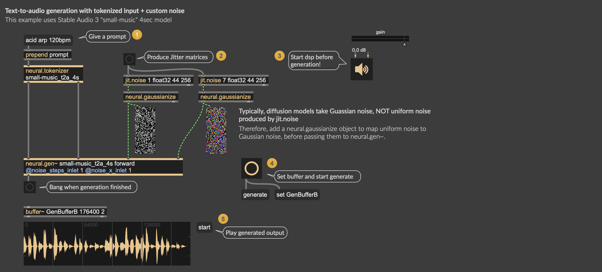
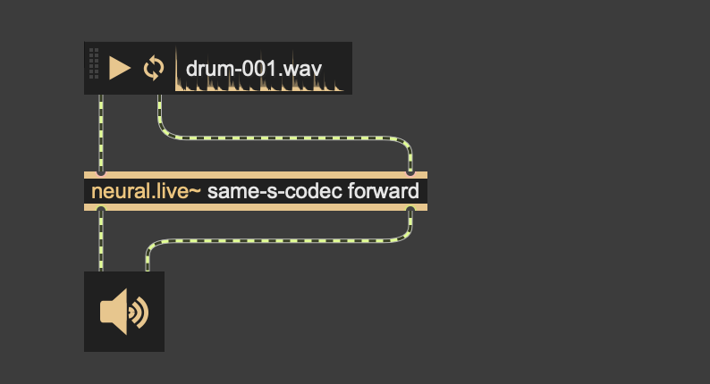
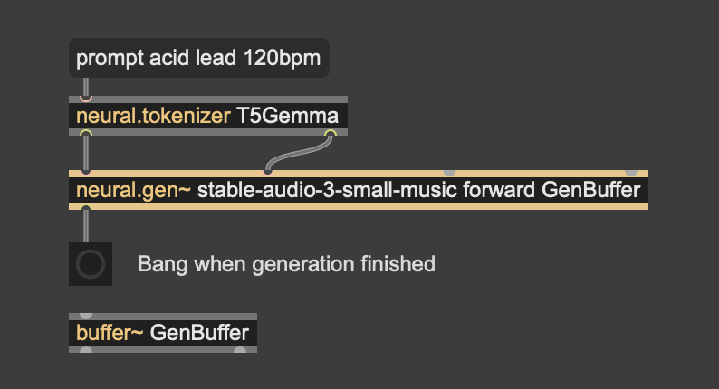
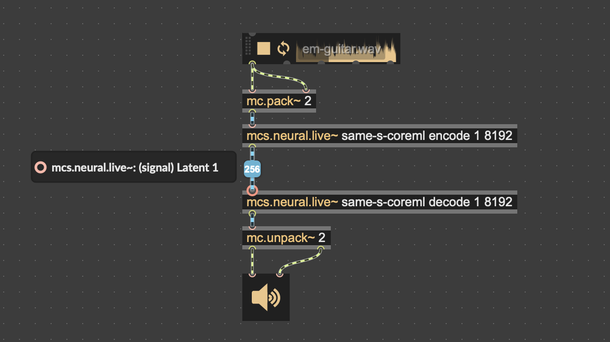
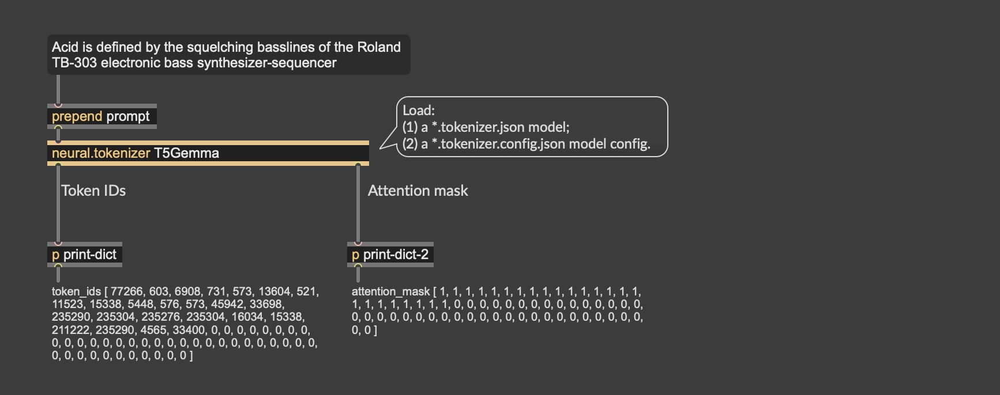
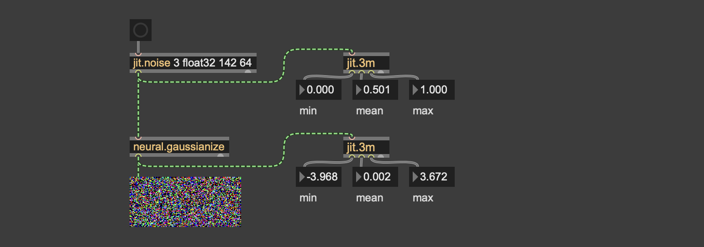
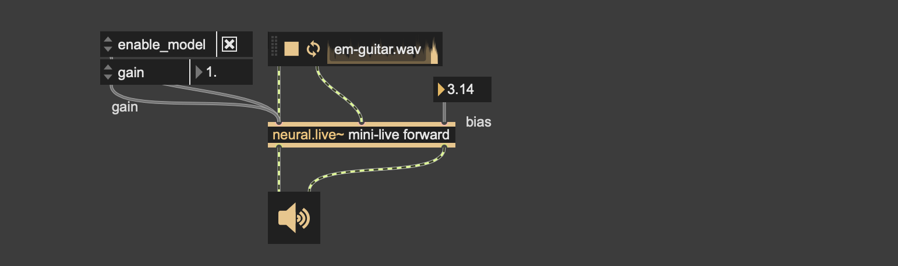
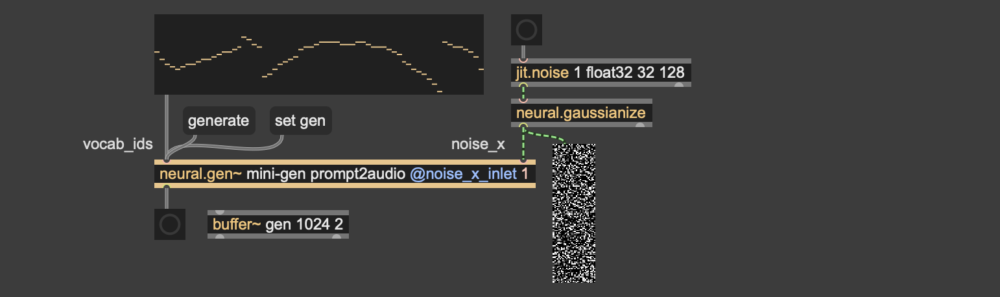

# `neural`: neural audio synthesis in Max/MSP

[](https://pypi.org/project/neural-tilde/) [](https://github.com/jasper-zheng/neural_tilde) [](https://pytorch.org/executorch/)

**Max externals for running neural synthesis models realtime/offline.**   
Models are exported from PyTorch with [ExecuTorch](https://pytorch.org/executorch/) and run inside Max with hardware acceleration on CPU / GPU / ANE (Apple Neural Engine).




This package has two families of Max objects:

| object | use it for |
| --- | --- |
| `neural.live~` (`mc/mcs`) | Neural synthesis with real-time streaming I/O (e.g. neural vocoder, neural codecs...) |
| `neural.gen~` | Neural synthesis with one-shot offline generation (e.g. latent-diffusion text-to-audio, audio-to-audio...) |
| `neural.tokenizer` | [Utility] Tokenize a text prompt into token IDs and attention mask |
| `neural.gaussianize` | [Utility] Map uniform `jit.noise` to Gaussian noise |
| `neural.info` | [Utility] Inspect a model's inlets/outlets, attributes, conditions, etc. |

**Supported models:**  
 - [Live] [RAVE-CoreML](https://github.com/jasper-zheng/RAVE-CoreML) A streamable codec for timbre transfer / latent-space audio manipulation
 - [Live] [SAME-S](https://github.com/jasper-zheng/streamable-same-s): A streamable codec for audio encoding/decoding
 - [Live] [Open-Unmix-Live](https://github.com/jasper-zheng/open-unmix-maxmsp) Realtime source separation for vocals, drums, bass
 - [Gen] [Stable Audio 3](https://github.com/jasper-zheng/stable-audio-3-tilde): Latent diffusion transformer for text-to-audio, audio-to-audio, inpainting
 - [Gen] [CodiCodec-Flow](https://github.com/jasper-zheng/codicodec-flow) [Available soon]

**Note:** Currently only available for MaxMSP on Apple Silicon, macOS. For Windows/CUDA, it's on the todo list. 

**Acknowledgement:** `neural.live~` and its `mc`, `mcs` variants reused an extensive amount of code from [`nn~`](https://github.com/acids-ircam/nn_tilde), migrated from TorchScript/libtorch to more modern ExecuTorch. See [Migrate from nn~](#migrate-from-nn). `nn~` is the work by [acids-ircam](https://github.com/acids-ircam), licensed **CC BY-NC 4.0**. 


## Table of Contents
- [How It Works](#how-it-works)
- [Install the Externals](#install-the-externals)
- [Objects](#objects)
  - [`neural.live~`](#neuralive)
  - [`neural.gen~`](#neuralgen)
  - [`mc.neural.live~` / `mcs.neural.live~`](#mcneuralive--mcsneuralive)
  - [`neural.tokenizer`](#neuraltokenizer)
  - [`neural.gaussianize`](#neuralgaussianize)
- [Use Pre-trained Models](#use-pre-trained-models)
  - [File Structure](#file-structure)
  - [Methods](#methods)
  - [Input Roles](#input-roles)
- [Export Your Own Neural Synthesis Model](#export-your-own-neural-synthesis-model)
- [Full Protocol](#full-protocol)
- [Migrate from `nn~`](#migrate-from-nn)
- [Build the Externals from Source](#build-the-externals-from-source)
- [Credits](#credits)


## How It Works

 - **Export**: Export a PyTorch neural audio model using [ExecuTorch](https://docs.pytorch.org/executorch/main/getting-started.html), with a target hardware backend (see below). This results in a `.pte` (the runnable program + weights) file.  
 - **Config**: Create a `.json` metadata file that details inlet/outlet, ratio, attributes, condition shapes, etc. 
 - **Load**: Hand `neural.live~` / `neural.gen~` the `.pte` and `.json` files in Max.

### Supported back-ends:

- **[MLX](https://github.com/ml-explore/mlx)** - Uses Apple-Silicon GPU.
- **[Core ML](https://developer.apple.com/documentation/coreml)** - Uses all compute units by default (CPU / GPU / ANE); selectable via the `coreml_compute_units` export kwarg. Needs **macOS 15+** at runtime.
- **[MPS](https://docs.pytorch.org/executorch/stable/backends/mps/mps-overview.html)** - Apple-Silicon GPU via MPSGraph. (Deprecated by ExecuTorch, use Core ML or MLX instead)
- **[XNNPACK](https://github.com/google/XNNPACK)** - CPU inference with optimized kernels.
- **portable** - plain, unoptimized C++ kernels, maximum compatibility
- ~~CUDA~~ - Windows CUDA in progress
<!-- - **[Metal](https://github.com/pytorch/executorch/tree/main/backends/apple/metal)** *(experimental)* - Apple-Silicon GPU via AOTInductor. Compiles the whole graph to a Metal `.so` embedded in the `.pte` **at export time**, so it loads fast (no Core ML–style compile at load). Needs an ExecuTorch runtime built with `-DEXECUTORCH_BUILD_METAL=ON` + **macOS**. -->


## Install the externals

Download prebuilt externals and Max help patches from the [releases page](https://github.com/jasper-zheng/neural-tilde/releases). 

To install: 
 - Unzip and copy the `neural_tilde` folder into your Max **Packages** folder, e.g. `~/Documents/Max 9/Packages/`
 - Remove the quarantine flag by running this command in Terminal:  
    ```bash
    codesign --force --deep -s - ~/Documents/Max\ 9/Packages/neural_tilde/externals/*.mxo
    xattr -dr com.apple.quarantine ~/Documents/Max\ 9/Packages/neural_tilde
    ``` 
 - Restart Max. All 7 objects will then be available.
 - If Max give you a warn about quarantine, please proceed.

If the externals still fail to load, you may consider building the externals yourself by following [Build.md](Build.md).

## Objects

`neural.live~` and `neural.gen~` are the main objects for running neural synthesis models. They are for different use cases: `neural.live~` is for realtime streaming models (e.g. neural vocoder, neural codec, etc.), while `neural.gen~` is for offline generative models (e.g. one-shot text-to-audio, audio inpainting).

| `neural.live~` | `neural.gen~` |
| --- | --- |
|  |  |


### `neural.live~`:

- **Arguments:** `[neural.live~ <model.pte> <method>]`. 
- **Signal inlets / outlets** are created according to the `.json` metadata. 
- **Conditions / attributes / noise** (if any) are created according to the `.json` metadata (see [Input Roles](#input-roles)).
- **Turn computation on:** the `enable_model` attribute defaults to **off**, so the
  object outputs silence until you set `enable_model` to 1
- **Buffer size** is read from the model's `.json` metadata, this is **fixed when the model is exported**.


### `neural.gen~`:

- **Arguments:** `[neural.gen~ <model.pte> <method> <buffer>]`.
- **Buffer**: Create a `buffer~` to hold the generated outputs, set its name to `neural.gen~` by the third argument, or with the `set <buffer>` message. Add an optional start offset in milliseconds — `set <buffer> <ms>` — to place the output at that point in the buffer instead of resizing it: the buffer keeps its length and its content before `<ms>`, the output is written from `<ms>` onward, and anything past the buffer's end is cropped. With no offset, `set <buffer>` resizes the buffer to the model's output length as before. 
- **Conditions / attributes / noise** (if any) are created according to the `.json` metadata (see [Input Roles](#input-roles)).

> **Notes.** A `buffer~` carries Max's project sample-rate while the mode might have a fixed rate. If your patch runs at a different rate, the data is correct but plays back at the wrong pitch.

### `mc.neural.live~` / `mcs.neural.live~`:
Use `mc.neural.live~` to run one model across every channel of an `mc.` patch cord, or
`mcs.neural.live~` to process a fixed batch of streams in a single forward pass.





### `neural.tokenizer`:

Use `neural.tokenizer` to turn a prompt into `token_ids` + `attention_mask`, emitting each as a single-key dictionary on its two outlets. Both outputs are used as **condition inputs** to `neural.gen~` or `neural.live~`.  

Tokenizers are configured by `*.tokenizer.json` and `*.tokenizer.config.json`:




### `neural.gaussianize`:

Diffusion models often requires Gaussian noise as inputs. However, `jit.noise` / `random` produces uniformed distribution. Therefore, `neural.gaussianize` helps map a uniform distribution to a Gaussian one.




## Use pre-trained models

### File structure

`neural.live~` and `neural.gen~` run model exported from PyTorch, it needs:
 - `*.pte` the model weights + program
 - `*.json` the metadata defining model's inlets/outlets, attributes, conditions, etc.

They should have **the same** filename, put together in a folder. 

**Make sure to add your model's path in Max:** In Max, open **"Options - File Preferences"**, click **"Add Path"** on the bottom left corner, add your model's folder. 


| file | what it is |
| --- | --- |
| `my_diffusion.pte` | the ExecuTorch program + weights |
| `my_diffusion.json` | model metadata: typed inputs/output (no tokenizer settings) |


**Tokenizer:** If your model uses a prompt-based inputs (e.g. Stable Audio 3), the exported model also has a tokenizer bundle:

| file | what it is |
| --- | --- |
| `my_tokenizer.tokenizer.json` | the HuggingFace fast tokenizer |
| `my_tokenizer.tokenizer.config.json` | tokenizer settings `neural.tokenizer` reads |


### Methods

A model may expose **several methods** with different inputs (e.g. `prompt2audio` and `audio2audio` for diffusion models, or `encode` and `decode` for codecs). `neural.gen/live~` selects only one when initialized. A method may have several inputs, each with a role, see below.

### Input Roles

A method may take **several inputs**, each with a **role**. The role is declared in the model's `.json` metadata, see [PROTOCOL.md 2.4 Input Roles](PROTOCOL.md#24-input-roles) for details.  

**Five input roles are supported:**

| role | kinds | in `neural.gen/live~` | examples |
|---|---|---|---|
| `attribute` | live / gen | A scalar number exposed as a Max attribute. Its current value is fed to the model in every run. | temperature, cfg scale, duration, etc. |
| `noise` | live / gen | By default, all noises are derived from the "seed" attribute. Alternatively, if a noise input has a shape of [planes × H × W], an inlet will be created, customized noises from **Jitter matrices** are allowed.| initial noise for diffusion, latent noise for codec, etc. |
| `condition` | live / gen | Additional control vector supplied from inlets, as a `list` (by position) or a `dictionary` (by name). | token IDs, attention mask, inpainting mask, time-varying controls, etc. |
| `signal` | live only | Multi-channel signal from signal inlets. Supports time-domain compression (e.g., encoder/decoder in a codec that downsamples audio-rate 44.1 kHz to latent-rate 21.5 Hz). Exactly one `signal`-role input per method. | 
| `buffer` | gen only | An init waveform read from a Max `buffer~` for audio-to-audio (`init <buffer>`). Resampled and cropped to the declared shape. An optional offset — `init <buffer> <ms>` — starts the read `<ms>` into the source buffer. | 


**Two output roles:**

| role | kinds | in `neural.gen/live~` |
|---|---|---|
| `signal` | live | Signal output from the model, up/downsampled if required. |
| `buffer` | gen | Write `channels × length` into a `buffer~` at `sample_rate`. |


## Export your own neural synthesis model

To export your own neural synthesis model to `neural.live/gen~`, use the helper in [`python_tools/`](python_tools/). It provides the `neural_tilde` Python module. It can be installed with pip:

```bash
pip install neural-tilde
# Install the `neural_tilde` module, cached_conv, executorch, coremltools
```


### Usage:

 - Subclass `neural_tilde.LiveModule` / `.GenModule`
 - Build your model
 - **Register inputs:** declare inputs and their roles using `register_attribute` / `register_noise` / `register_condition`.
 - **Register tokenizer [optional]:** If your model has a tokenizer, use `register_tokenizer(...)` to register it. 
 - **Register buffer [optional]:** If your model has a buffer input, use `register_buffer_input(...)` to register it.
 - **Register methods:** use `register_method(...)` register each method and their inputs / outputs. Registered roles are listed in order via the `inputs=[...]` argument; the method takes them after the audio tensor (e.g., `forward(self, x, gain, bias)`). 
 - **Export model:** Use `export_to_pte(..., delegate="coreml")` to export, which will result in the model weights `.pte` and the metadata `.json`

See [PROTOCOL.md 2.4 Input Roles](PROTOCOL.md#24-input-roles) for detailed Python API.

### Live Example:

A complete `live~` example is in
[`examples/export_live_example.py`](examples/export_live_example.py):

```python
import cached_conv as cc
from neural_tilde import LiveModule

cc.use_cached_conv(True)              # Use cached_conv for streaming

class MyLiveModel(LiveModule):
    def __init__(self, hidden: int = 16, kernel_size: int = 3):
        super().__init__()
        pad = cc.get_padding(kernel_size)
        self.net = cc.CachedSequential(
            cc.Conv1d(2, hidden, kernel_size, padding=pad),
            nn.GELU(),
            cc.Conv1d(hidden, 2, kernel_size, padding=pad)
        )
    def forward(self,
                x: torch.Tensor,        # [batch, 2, time]   (signal)
                gain: torch.Tensor,     # [1]                (attribute)
                bias: torch.Tensor      # [batch, 1, 1]      (condition)
                ) -> torch.Tensor:
        x = x + bias.reshape(-1, 1, 1)
        y = self.net(x)                 # [batch, 2, time]
        return y * gain.reshape(1, 1, 1)

model = MyLiveModel()

# Register the model's inputs and outputs:
model.register_attribute("gain", default=1.0, minimum=0.0, maximum=2.0)
model.register_condition("bias", shape=[1, 1], dtype="float32")
model.register_method("forward", in_channels=2, in_ratio=1,
                      out_channels=2, out_ratio=1,
                      inputs=["gain", "bias"]
                      )

# Export the model with Core ML delegate:
model.export_to_pte("mini-live", delegate="coreml", buffer_size=4096)
```

To run the above example:
```bash
python examples/export_live_example.py mini-live
```

Results in:




### Gen Example:

A complete `gen~` example is in [`examples/export_gen_example.py`](examples/export_gen_example.py):

```python
from neural_tilde import GenModule

VOCAB = 32              # toy vocabulary
LATENT = 128            # latent channels
STEPS = 32              # latent time steps
LENGTH = STEPS * STEPS  # 1024 audio samples

class MyGenModel(nn.Module):
    def __init__(self) -> None:
        super().__init__()
        self.embed = nn.Embedding(VOCAB, LATENT)
        self.up = nn.ConvTranspose1d(LATENT, 2, kernel_size=STEPS, stride=STEPS)

    def _decode(self, z: torch.Tensor) -> torch.Tensor:
        return torch.tanh(self.up(z))           # [1, 2, LENGTH]

    def prompt2audio(self,
                     vocab_ids: torch.Tensor,   # [1, 64]             (condition)
                     noise_x: torch.Tensor,     # [1, LATENT, STEPS]  (noise)
                     ) -> torch.Tensor:
        emb = self.embed(vocab_ids)             # [1, 64, LATENT]
        cond = emb.mean(1)                      # [1, LATENT]
        z = noise_x + cond.unsqueeze(-1)        # [1, LATENT, STEPS]
        return self._decode(z)

model = GenModule(TinyGen())
model.register_condition("vocab_ids", [1, 64], "int64")
model.register_noise("noise_x", [1, LATENT, STEPS])

model.register_method("prompt2audio",
                      inputs=["vocab_ids", "noise_x"],
                      out_channels=2, out_length=LENGTH,
                      out_sample_rate=44100
                      )

path = model.export_to_pte("mini-gen", delegate="coreml")
```
To run the above example:
```bash
python examples/export_gen_example.py mini-gen
```

Results in: 



### Tokenizer Example:

The `register_tokenizer(...)` method registers a HuggingFace tokenizer if the model has one (in the form of a `tokenizer.json` file). If you have a custom tokenizer, you can use `neural_tilde.Tokenizer` to export it to `.tokenizer.json` and `.tokenizer.config.json`:

A complete example is in [`examples/export_tokenizer_example.py`](examples/export_tokenizer_example.py):

```python 
from neural_tilde import Tokenizer

tok = Tokenizer(tokenizer_file, 
                max_length=256,
                ids_key="input_ids", mask_key="attention_mask")
tok.write_files(out_stem)
```


## Full Protocol

The full input-role / metadata template is in [PROTOCOL.md](PROTOCOL.md).

## Migrate from `nn~`

The `neural.*~` package originated from [`nn~`](https://github.com/acids-ircam/nn_tilde) (Antoine Caillon & Axel Chemla--Romeu-Santos, ACIDS-IRCAM). The underlying framework moved from **TorchScript** (deprecated in PyTorch 2.10) to **[ExecuTorch](https://docs.pytorch.org/executorch/stable/index.html)**, with:
 - Hardware acceleration on Apple Silicon, 
 - A new offline generation object (`neural.gen~`), 
 - Better support for modern generative models' input types (text, noise, condition),
 - A new JSON model metadata.

See the table below for a comparison of the two packages:

| |`neural.*~`|`nn~`|
|---|---|---|
| Offline generation | ✅ `neural.gen~` | ❌ |
| Real-time streaming | ✅ `neural.live~` | ✅ |
| Input types | ✅ `signal`, `attribute`, `condition`, `noise`, `buffer` | ❌ only `signal` + `attribute` |
| Attributes | ✅ Added as native Max attributes | ❌ use `set` / `get` messages |
| Backends | ✅ MLX, CoreML, XNNPack, MPS, Portable | ❌ only TorchScript |
| Dynamic device | ❌ Fixed when exporting | ✅ Can be switched in runtime |
| Dynamic buffer size | ❌ Fixed when exporting | ✅ Specified as an argument |
| Library | ExecuTorch | TorchScript (deprecated in PyTorch 2.10) |
| Python Tools | `pip install neural_tilde` | `pip install nn_tilde` |

### Migration tool for RAVEs

If you have a RAVE TorchScript (`.ts`) model exported for `nn~`, you can migrate it to `neural.live~` with the helper in [`python_tools/migrate.py`](python_tools/migrate.py):

```bash
python -m neural_tilde.migrate musicnet.ts --out musicnet --delegate coreml
```

**Note:** This is experimental, migration is not guaranteed to succeed on all models. It also disables the prior methods if your model has one. It also disable the noise-synth if it has one (e.g., the one used in many percussion models).

## Build the externals from source

Please refer to [Build.md](Build.md)


## Credits

`neural.live~` and its `mc`/`mcs` variants' C++ externals and the Python tools derive from `nn~` by Antoine Caillon and
Axel Chemla--Romeu-Santos (ACIDS-IRCAM).
